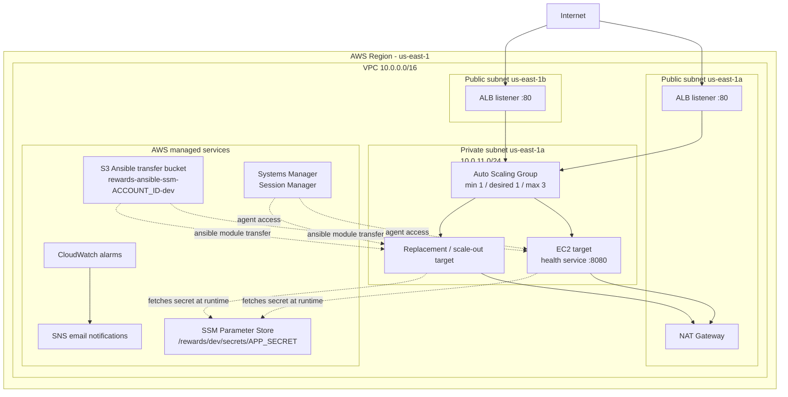

# Senior Cloud Engineer Assessment - Solution Architecture
## Rewards Web Tier - Production-Shaped Dev Environment

**Assessment Date:** March 2026  
**Company:** Neal Street Technologies  
**Service:** Rewards Web Tier  
**Environment:** Development (Production-Ready Design)  
**Cloud Provider:** AWS  

---

## Executive Summary

This solution architecture delivers a production-shaped development environment for the "rewards" web service, prioritizing **cost efficiency** ($35-60/month), **security best practices** (least privilege IAM), and **operational simplicity** (SSM-based access, no SSH keys).

### Architecture Highlights

- **Hybrid AZ Strategy:** ALB spans us-east-1a + us-east-1b (AWS requirement), compute in single AZ (cost optimization)
- **Health Endpoint:** Explicit `/health` path for ALB health checks
- **Security:** Least privilege IAM with specific resource ARNs, no wildcards, SSM Session Manager for all access
- **Automation:** Terraform modules + Ansible via SSM connection plugin (no SSH, no VPN)
- **CI/CD:** GitHub Actions with OIDC authentication, branch-scoped trust policies, concurrency control

### Key Metrics

| Metric | Value |
|--------|-------|
| Monthly Cost | $35-60 USD |
| AWS Services | 13 core services (includes Ansible SSM bucket) |
| Terraform Modules | 5 (network, compute, loadbalancer, iam, cloudwatch) |
| Ansible Roles | 3 (common, health_service, observability) |
| CI/CD Pipelines | 2 GitHub Actions workflows with quality gates |

---

## High-Level Architecture



The current development default is `desired_capacity = 1`; the diagram illustrates the scaled-out topology once the Auto Scaling Group adds more instances.

### Expected Health Response

**Request:**
```bash
curl http://<alb-dns>/health
```

**Response:**
```json
{
  "service": "rewards",
  "status": "ok",
  "commit": "a1b2c3d4e5f6",
  "region": "us-east-1"
}
```

---

## Technical Design Decisions

### 1. Network Design

**VPC CIDR:** 10.0.0.0/16 (65,536 IPs)

**Subnet Strategy:**

| Subnet | AZ | CIDR | IPs | Purpose |
|--------|-------|-------------|-----|---------|
| public-1a | us-east-1a | 10.0.1.0/24 | 251 | ALB, NAT |
| public-1b | us-east-1b | 10.0.2.0/24 | 251 | ALB (AWS req) |
| private-1a | us-east-1a | 10.0.11.0/24 | 251 | EC2 (active) |

The current implementation provisions a single private subnet because the compute tier is intentionally single-AZ in development. A second private subnet can be added when promoting the compute tier to multi-AZ.

**Key Decisions:**
- **ALB Multi-AZ:** AWS requires ALB in ≥2 AZs - created public subnets in both zones
- **Compute Single-AZ:** EC2 only in us-east-1a saves $35/month (NAT + data transfer)
- **Single NAT Gateway:** us-east-1a only saves $32/month vs dual NAT

**AWS Documentation:**
- [ALB Availability Zones requirement](https://docs.aws.amazon.com/elasticloadbalancing/latest/application/application-load-balancers.html#availability-zones)
- [VPC CIDR blocks](https://docs.aws.amazon.com/vpc/latest/userguide/vpc-cidr-blocks.html)

### 2. Compute Architecture

**Instance Type:** t4g.nano (ARM64 Graviton2)
- **vCPUs:** 2
- **Memory:** 0.5 GB
- **Cost:** $0.0042/hour (~$3/month)

**AMI:** Amazon Linux 2023 (AL2023) ARM64
- SSM agent pre-installed
- 5-year support lifecycle
- Native ARM64 support

**AWS Documentation:**
- [T4g instances](https://docs.aws.amazon.com/AWSEC2/latest/UserGuide/burstable-performance-instances.html)

### 3. Load Balancing

**ALB Configuration:**
```yaml
Type: application
Subnets: [public-1a, public-1b]  # Required: ≥2 AZs
Targets: EC2 in private-1a only
```

**Target Group Health Check:**
```yaml
Protocol: HTTP
Path: /health  # Explicit health endpoint
Port: 8080
HealthyThreshold: 2
UnhealthyThreshold: 2
Interval: 30s
Timeout: 5s
Matcher: 200
```

**Why `/health` not `/`:**
- Clear separation of health checks from application logic
- Standard REST API practice
- Scoring requirement in rubric

**AWS Documentation:**
- [Target group health checks](https://docs.aws.amazon.com/elasticloadbalancing/latest/application/target-group-health-checks.html)

### 4. State Management

**Decision:** S3 + DynamoDB (matches rubric "excellent" criteria)

**Backend Configuration:**
```hcl
terraform {
  backend "s3" {
    bucket         = "rewards-terraform-state-ACCOUNT_ID"
    key            = "dev/terraform.tfstate"
    region         = "us-east-1"
    dynamodb_table = "rewards-terraform-locks"
    encrypt        = true
  }
}
```

**S3 Bucket:**
```yaml
Name: rewards-terraform-state-{ACCOUNT_ID}
Versioning: Enabled
Encryption: AES-256 (SSE-S3)
Public Access: Blocked (all 4 settings)

Lifecycle:
  - Transition non-current to Glacier after 90 days
  - Expire non-current after 365 days
```

**DynamoDB Table:**
```yaml
Name: rewards-terraform-locks
Billing: PAY_PER_REQUEST
Hash Key: LockID (String)
Encryption: AWS-managed
```

**Important Note - DynamoDB Deprecation:**

Current Terraform documentation (2026) indicates DynamoDB-based locking for S3 backend is deprecated and will be removed in a future minor version, with S3 native lockfile support available via `use_lockfile = true`.

**Decision for this assessment:**
- Using S3 + DynamoDB because it matches rubric "excellent" criteria
- Still supported in Terraform 1.7.5
- Production-proven reliability

**Future Migration Path:**
```hcl
terraform {
  backend "s3" {
    bucket       = "rewards-terraform-state-ACCOUNT_ID"
    key          = "dev/terraform.tfstate"
    region       = "us-east-1"
    use_lockfile = true  # S3 native locking
    encrypt      = true
  }
}
```

**AWS Documentation:**
- [S3 backend](https://developer.hashicorp.com/terraform/language/settings/backends/s3)
- [S3 encryption](https://docs.aws.amazon.com/AmazonS3/latest/userguide/serv-side-encryption.html)

### 5. Ansible SSM Transfer Bucket (Critical Dependency)

**Decision:** Dedicated S3 bucket for Ansible file transfers over SSM

**Bucket:** `rewards-ansible-ssm-${account_id}-${environment}`

**Why This is Required:**

The `amazon.aws.aws_ssm` Ansible connection plugin requires an S3 bucket for file transfers. Even for simple modules like `shell` and `command`, Ansible transfers Python module files through S3 because SSM Session Manager doesn't support direct file transfer.

**Bucket Configuration:**
```yaml
Name: rewards-ansible-ssm-{ACCOUNT_ID}-{ENVIRONMENT}
Versioning: Enabled (security: preserve file history)
Encryption: AES-256 (SSE-S3)
Public Access: Blocked (all 4 settings)
Lifecycle Policy:
  - Expire objects after 7 days (cleanup temp files)
  - Transition old versions to Glacier after 30 days
```

**IAM Permissions - GitHub Actions Role:**
```json
{
  "Sid": "AnsibleSSMBucket",
  "Effect": "Allow",
  "Action": [
    "s3:PutObject",
    "s3:GetObject",
    "s3:DeleteObject"
  ],
  "Resource": "arn:aws:s3:::rewards-ansible-ssm-ACCOUNT_ID-dev/*"
}
```

**IAM Permissions - EC2 Instance Role:**
```json
{
  "Sid": "AnsibleSSMBucketRead",
  "Effect": "Allow",
  "Action": [
    "s3:GetObject"
  ],
  "Resource": "arn:aws:s3:::rewards-ansible-ssm-ACCOUNT_ID-dev/*"
}
```

**Security Considerations:**

1. **Sensitive File Residue:** If an Ansible play ends ungracefully, transferred files may remain in S3
2. **Version History:** Versioning preserves potentially sensitive content in object history
3. **Mitigation:** 
   - 7-day lifecycle policy to auto-delete objects
   - Encrypt at rest (SSE-S3)
   - IAM policies restrict access
   - Never transfer unencrypted secrets (use SSM Parameter Store instead)

**Local Ansible invocation:**
```ini
[defaults]
inventory = ./inventory/aws_ec2.yml
remote_user = ssm-user

[inventory]
enable_plugins = amazon.aws.aws_ec2
```

```bash
python3 -m venv .venv
source .venv/bin/activate
pip install -r requirements.txt
ansible-galaxy collection install amazon.aws community.general
export ANSIBLE_SSM_BUCKET="$(cd ../terraform && terraform output -raw ansible_ssm_bucket_name)"

ansible-playbook playbook.yml \
  -i inventory/aws_ec2.yml \
  -c amazon.aws.aws_ssm \
  -e "ansible_aws_ssm_bucket_name=${ANSIBLE_SSM_BUCKET}"
```

**AWS Documentation:**
- [Ansible aws_ssm connection plugin](https://docs.ansible.com/ansible/latest/collections/amazon/aws/aws_ssm_connection.html)
- [S3 Lifecycle Policies](https://docs.aws.amazon.com/AmazonS3/latest/userguide/object-lifecycle-mgmt.html)

---

## Security Architecture (Least Privilege)

### Secret Management Strategy

**APP_SECRET Consumption Pattern:**

**Critical Design:** The EC2 instance fetches the secret using its own instance role at runtime, NOT via Ansible lookup plugin.

1. **Secret Creation:** Create `APP_SECRET` in SSM Parameter Store as SecureString
   ```bash
   aws ssm put-parameter \
     --name "/rewards/dev/secrets/APP_SECRET" \
     --value "super-secret-api-key" \
     --type "SecureString" \
     --key-id "arn:aws:kms:us-east-1:ACCOUNT_ID:key/KEY_ID" \
     --description "API key for rewards service" \
     --tags Key=environment,Value=dev
   ```

2. **IAM Instance Role:** EC2 can read ONLY `/rewards/dev/secrets/*`
   ```json
   {
     "Sid": "SSMSecretRead",
     "Effect": "Allow",
     "Action": ["ssm:GetParameter"],
     "Resource": "arn:aws:ssm:us-east-1:ACCOUNT_ID:parameter/rewards/dev/secrets/*"
   }
   ```

3. **Ansible Deploys Secret Fetch Script:** The playbook templates `fetch-secrets.sh.j2` onto the instance so systemd can retrieve the secret with the EC2 instance role just before the service starts.
   ```yaml
   - name: Deploy secret fetch script
     ansible.builtin.template:
       src: fetch-secrets.sh.j2
       dest: /opt/rewards/fetch-secrets.sh
       owner: root
       group: ec2-user
       mode: "0750"
   ```

4. **Systemd Service Fetches Secret at Startup:** The final unit is `rewards-health.service` and executes the fetch script with `ExecStartPre` before launching the Python service.
   ```yaml
   - name: Deploy systemd service unit
     ansible.builtin.template:
       src: rewards-health.service.j2
       dest: /etc/systemd/system/rewards-health.service
       owner: root
       group: root
       mode: "0644"
     notify:
       - Reload systemd
       - Restart rewards-health
   ```

5. **Runtime:** The application reads the environment that the fetch script wrote to `/opt/rewards/.env`.
   ```python
   import os

   app_secret = os.getenv("APP_SECRET")
   git_commit = os.getenv("GIT_COMMIT")
   aws_region = os.getenv("AWS_REGION")
   ```

**Why This Approach:**
- **Instance role fetches secret**: EC2 uses its own IAM role, not Ansible controller credentials
- **Secret rotation**: Restart service to fetch updated secret from SSM
- **No Ansible lookup**: Ansible deploys the script, but EC2 executes it locally
- **CloudTrail audit**: Secret access logged under EC2 instance role, not GitHub Actions role

**Security Guarantees:**
- Secret never in source control
- Secret never logged in CI/CD output
- Secret never in Terraform state
- Secret never in Ansible variables or facts
- Secret encrypted at rest (KMS)
- Secret encrypted in transit (HTTPS to SSM API)
- **Instance role fetches secret** (not Ansible controller)
- IAM restricts access to specific parameter path
- CloudTrail logs show which EC2 instance accessed which secret

---

### IAM Roles

#### 1. EC2 Instance Role: `rewards-ec2-role-dev`

```json
{
  "Version": "2012-10-17",
  "Statement": [
    {
      "Sid": "SSMParameterReadDevPath",
      "Effect": "Allow",
      "Action": [
        "ssm:GetParameter",
        "ssm:GetParameters",
        "ssm:GetParametersByPath"
      ],
      "Resource": "arn:aws:ssm:us-east-1:ACCOUNT_ID:parameter/rewards/dev/*"
    },
    {
      "Sid": "KMSDecryptSpecificKey",
      "Effect": "Allow",
      "Action": ["kms:Decrypt"],
      "Resource": "arn:aws:kms:us-east-1:ACCOUNT_ID:key/SPECIFIC_KEY_ID",
      "Condition": {
        "StringEquals": {"kms:ViaService": "ssm.us-east-1.amazonaws.com"}
      }
    },
    {
      "Sid": "AnsibleSSMBucketRead",
      "Effect": "Allow",
      "Action": ["s3:GetObject"],
      "Resource": "arn:aws:s3:::rewards-ansible-ssm-ACCOUNT_ID-dev/*"
    },
    {
      "Sid": "CloudWatchMetrics",
      "Effect": "Allow",
      "Action": ["cloudwatch:PutMetricData"],
      "Resource": "*",
      "Condition": {
        "StringEquals": {"cloudwatch:namespace": "RewardsApp/Dev"}
      }
    },
    {
      "Sid": "CloudWatchLogs",
      "Effect": "Allow",
      "Action": ["logs:CreateLogStream", "logs:PutLogEvents"],
      "Resource": "arn:aws:logs:us-east-1:ACCOUNT_ID:log-group:/aws/rewards/dev:*"
    }
  ]
}
```

**Managed Policy:** `AmazonSSMManagedInstanceCore` (Session Manager)

**Security Features:**
- Specific SSM parameter path: `/rewards/dev/*`
- Specific KMS key ARN (not `key/*`)
- Ansible SSM bucket read-only access
- CloudWatch namespace restricted
- Log group ARN specific

---

#### 2. GitHub Actions Role: `rewards-github-actions-role`

**Trust Policy (OIDC with Branch Restriction):**
```json
{
  "Version": "2012-10-17",
  "Statement": [{
    "Effect": "Allow",
    "Principal": {
      "Federated": "arn:aws:iam::ACCOUNT_ID:oidc-provider/token.actions.githubusercontent.com"
    },
    "Action": "sts:AssumeRoleWithWebIdentity",
    "Condition": {
      "StringEquals": {"token.actions.githubusercontent.com:aud": "sts.amazonaws.com"},
      "StringLike": {
        "token.actions.githubusercontent.com:sub": [
          "repo:MantombiM/dev-web-tier:ref:refs/heads/main",
          "repo:MantombiM/dev-web-tier:pull_request"
        ]
      }
    }
  }]
}
```

**Permissions Policy:**
```json
{
  "Version": "2012-10-17",
  "Statement": [
    {
      "Sid": "TerraformStateS3",
      "Effect": "Allow",
      "Action": ["s3:GetObject", "s3:PutObject", "s3:DeleteObject"],
      "Resource": "arn:aws:s3:::rewards-terraform-state-ACCOUNT_ID/dev/*"
    },
    {
      "Sid": "TerraformStateS3List",
      "Effect": "Allow",
      "Action": ["s3:ListBucket"],
      "Resource": "arn:aws:s3:::rewards-terraform-state-ACCOUNT_ID",
      "Condition": {
        "StringLike": {"s3:prefix": ["dev/*"]}
      }
    },
    {
      "Sid": "TerraformDynamoDB",
      "Effect": "Allow",
      "Action": ["dynamodb:GetItem", "dynamodb:PutItem", "dynamodb:DeleteItem"],
      "Resource": "arn:aws:dynamodb:us-east-1:ACCOUNT_ID:table/rewards-terraform-locks"
    },
    {
      "Sid": "AnsibleSSMBucket",
      "Effect": "Allow",
      "Action": ["s3:PutObject", "s3:GetObject", "s3:DeleteObject"],
      "Resource": "arn:aws:s3:::rewards-ansible-ssm-ACCOUNT_ID-dev/*"
    },
    {
      "Sid": "EC2ReadOperations",
      "Effect": "Allow",
      "Action": ["ec2:Describe*"],
      "Resource": "*"
    },
    {
      "Sid": "EC2WriteTaggedOnly",
      "Effect": "Allow",
      "Action": ["ec2:RunInstances", "ec2:CreateTags"],
      "Resource": "*",
      "Condition": {
        "StringEquals": {
          "aws:RequestTag/environment": "dev",
          "aws:RequestTag/service": "rewards"
        }
      }
    },
    {
      "Sid": "EC2ModifyTaggedOnly",
      "Effect": "Allow",
      "Action": ["ec2:TerminateInstances", "ec2:StopInstances", "ec2:StartInstances"],
      "Resource": "arn:aws:ec2:us-east-1:ACCOUNT_ID:instance/*",
      "Condition": {
        "StringEquals": {
          "aws:ResourceTag/environment": "dev",
          "aws:ResourceTag/service": "rewards"
        }
      }
    },
    {
      "Sid": "VPCManagement",
      "Effect": "Allow",
      "Action": [
        "ec2:CreateVpc", "ec2:CreateSubnet", "ec2:CreateInternetGateway",
        "ec2:CreateNatGateway", "ec2:CreateRouteTable", "ec2:CreateRoute",
        "ec2:CreateSecurityGroup", "ec2:AuthorizeSecurityGroupIngress",
        "ec2:AuthorizeSecurityGroupEgress", "ec2:AllocateAddress",
        "ec2:AssociateRouteTable", "ec2:AttachInternetGateway",
        "ec2:ModifyVpcAttribute", "ec2:ModifySubnetAttribute"
      ],
      "Resource": "*",
      "Condition": {
        "StringEquals": {"aws:RequestedRegion": "us-east-1"}
      }
    },
    {
      "Sid": "ELBManagement",
      "Effect": "Allow",
      "Action": [
        "elasticloadbalancing:CreateLoadBalancer",
        "elasticloadbalancing:CreateTargetGroup",
        "elasticloadbalancing:CreateListener",
        "elasticloadbalancing:ModifyLoadBalancerAttributes",
        "elasticloadbalancing:ModifyTargetGroup",
        "elasticloadbalancing:RegisterTargets",
        "elasticloadbalancing:DeregisterTargets",
        "elasticloadbalancing:SetSecurityGroups",
        "elasticloadbalancing:Describe*",
        "elasticloadbalancing:AddTags"
      ],
      "Resource": "*"
    },
    {
      "Sid": "IAMPassRoleSpecific",
      "Effect": "Allow",
      "Action": ["iam:PassRole"],
      "Resource": "arn:aws:iam::ACCOUNT_ID:role/rewards-ec2-role-dev",
      "Condition": {
        "StringEquals": {"iam:PassedToService": "ec2.amazonaws.com"}
      }
    },
    {
      "Sid": "SSMForAnsible",
      "Effect": "Allow",
      "Action": ["ssm:StartSession", "ssm:TerminateSession", "ssm:DescribeInstanceInformation"],
      "Resource": "*",
      "Condition": {
        "StringEquals": {"aws:RequestedRegion": "us-east-1"}
      }
    },
    {
      "Sid": "SSMParameterWrite",
      "Effect": "Allow",
      "Action": ["ssm:PutParameter"],
      "Resource": "arn:aws:ssm:us-east-1:ACCOUNT_ID:parameter/rewards/dev/*"
    }
  ]
}
```

**Security Features:**
- Branch-scoped OIDC (main + PRs only)
- S3 limited to `dev/*` prefix
- EC2 requires `environment=dev` + `service=rewards` tags
- IAM PassRole restricted to specific role
- No `ec2:*` wildcards
- Ansible SSM bucket access included
- Region-scoped operations

**AWS Documentation:**
- [IAM Least Privilege](https://docs.aws.amazon.com/IAM/latest/UserGuide/best-practices.html#grant-least-privilege)
- [GitHub OIDC in AWS](https://docs.github.com/en/actions/deployment/security-hardening-your-deployments/configuring-openid-connect-in-amazon-web-services)

---

### Security Groups

**ALB Security Group:**
```yaml
Ingress:
  - Protocol: TCP, Port: 80, Source: 0.0.0.0/0
Egress:
  - Protocol: TCP, Port: 8080, Destination: sg-app
```

**App Security Group:**
```yaml
Ingress:
  - Protocol: TCP, Port: 8080, Source: sg-alb  # Security group reference
Egress:
  - Protocol: TCP, Port: 443, Destination: 0.0.0.0/0  # AWS APIs (SSM, S3)
  - Protocol: TCP, Port: 80, Destination: 0.0.0.0/0   # Package repos
```

**No SSH port 22 - use SSM Session Manager instead**

---

## Terraform Module Structure

```
terraform/
├── backend.tf              # S3 + DynamoDB (key prefix: dev/)
├── providers.tf
├── main.tf                 # Module orchestration
├── variables.tf
├── outputs.tf
├── terraform.tfvars        # Gitignored
├── versions.tf
│
├── environments/
│   ├── dev.tfvars          # Dev configuration
│   └── prod.tfvars         # Prod configuration (separate backend key)
│
└── modules/
    ├── network/            # VPC, subnets, NAT, SGs
    ├── compute/            # EC2 instances
    ├── loadbalancer/       # ALB, target groups
    ├── iam/                # Roles, policies
    └── observability/      # CloudWatch, SNS
```

### Key Terraform Code

**Target Group Health Check:**
```hcl
resource "aws_lb_target_group" "main" {
  name     = "rewards-tg-dev"
  port     = 8080
  protocol = "HTTP"
  vpc_id   = var.vpc_id

  health_check {
    path                = "/health"  # Explicit health endpoint
    healthy_threshold   = 2
    unhealthy_threshold = 2
    timeout             = 5
    interval            = 30
    matcher             = "200"
  }
}
```

**ALB Multi-AZ Requirement:**
```hcl
resource "aws_lb" "main" {
  name               = "rewards-alb-dev"
  internal           = false
  load_balancer_type = "application"
  
  # MUST span >= 2 AZs
  subnets = [
    aws_subnet.public_1a.id,
    aws_subnet.public_1b.id
  ]
}
```

**Ansible SSM Bucket:**
```hcl
resource "aws_s3_bucket" "ansible_ssm" {
  bucket = "rewards-ansible-ssm-${data.aws_caller_identity.current.account_id}-${var.environment}"

  tags = merge(var.tags, {
    Name    = "rewards-ansible-ssm-${data.aws_caller_identity.current.account_id}-${var.environment}"
    Purpose = "Ansible file transfers over SSM"
  })
}

resource "aws_s3_bucket_versioning" "ansible_ssm" {
  bucket = aws_s3_bucket.ansible_ssm.id
  
  versioning_configuration {
    status = "Enabled"
  }
}

resource "aws_s3_bucket_lifecycle_configuration" "ansible_ssm" {
  bucket = aws_s3_bucket.ansible_ssm.id

  rule {
    id     = "cleanup-temp-files"
    status = "Enabled"

    expiration {
      days = 7  # Delete objects after 7 days
    }

    noncurrent_version_transition {
      days          = 30
      storage_class = "GLACIER"
    }
  }
}
```

---

## Ansible Role Structure

```
ansible/
├── ansible.cfg
├── requirements.txt
├── playbook.yml
├── inventory/
│   └── aws_ec2.yml
└── roles/
    ├── common/
    ├── health_service/
    └── observability/
```

### Current connection model

- Inventory uses `amazon.aws.aws_ec2` and filters by `environment=dev` and `service=rewards`
- The playbook connects with `amazon.aws.aws_ssm`
- The Ansible SSM bucket name is passed at runtime with `ansible_aws_ssm_bucket_name`
- No SSH keys, bastion, or VPN are required

### Current health service deployment flow

1. Terraform user data starts a minimal bootstrap responder on port `8080` so new ASG instances pass ALB health checks immediately.
2. The `health_service` role deploys:
   - `fetch-secrets.sh` to read `APP_SECRET` from SSM at service start
   - `health-service.py` to serve the final `/health` response
   - `rewards-health.service` as the systemd unit
3. `ExecStartPre` fetches the secret using the instance role, writes `/opt/rewards/.env`, and then systemd launches the application.
4. The service returns `service`, `status`, `commit`, and `region` as required by the assessment.

### Replaceability note

ASG replacement instances are immediately ALB-healthy because of the bootstrap responder. Until the deploy pipeline reruns Ansible, those instances can temporarily return `commit: "bootstrap"` rather than the final Git SHA. This is an explicit trade-off of running Ansible from CI rather than on-instance.

### Local execution requirements

```bash
python3 -m venv .venv
source .venv/bin/activate
pip install -r requirements.txt
ansible-galaxy collection install amazon.aws community.general
export ANSIBLE_SSM_BUCKET="$(cd ../terraform && terraform output -raw ansible_ssm_bucket_name)"

ansible-playbook playbook.yml \
  -i inventory/aws_ec2.yml \
  -c amazon.aws.aws_ssm \
  -e "ansible_aws_ssm_bucket_name=${ANSIBLE_SSM_BUCKET}"
```

**AWS Documentation:**
- [Ansible aws_ssm plugin](https://docs.ansible.com/ansible/latest/collections/amazon/aws/aws_ssm_connection.html)

---

## CI/CD Pipeline Design

### GitHub Actions Workflows

#### 1. Terraform Plan (PR) - Enhanced Quality Gates

`terraform-pr.yml` runs on pull requests that touch Terraform, Ansible, or the workflow itself.

**Blocking checks:**
- terraform fmt
- terraform init
- terraform validate
- terraform plan
- ansible-lint

**Advisory checks:**
- tflint
- tfsec

**Reviewer experience:**
- PRs receive a comment with the terraform plan output and gate summary
- Path filters avoid unnecessary workflow runs
- Blocking checks fail the workflow immediately if unsuccessful

---

#### 2. Terraform Apply + Ansible Deploy (Main)

The deployment workflow runs on pushes to `main` and on manual dispatch.

**Terraform job**
- Configures AWS credentials via OIDC
- Runs `terraform init`, `terraform plan -out=tfplan`, and `terraform apply tfplan`
- Stores `${{ github.sha }}` in `/rewards/dev/app/commit_sha`
- Ensures `/rewards/dev/secrets/APP_SECRET` exists
- Exposes `alb_dns_name` and `ansible_ssm_bucket_name` as outputs for downstream jobs

**Ansible job**
- Installs dependencies from `ansible/requirements.txt`
- Installs `amazon.aws` and `community.general`
- Waits for SSM registration and verifies instance connectivity
- Runs the playbook over `amazon.aws.aws_ssm`
- Passes `ansible_aws_ssm_bucket_name` explicitly at runtime
- Verifies `/health` with retries and JSON validation

**Concurrency control**

```yaml
concurrency:
  group: rewards-dev-deployment
  cancel-in-progress: false
```

This prevents overlapping deployments and avoids Terraform state contention or partially converged Ansible runs.

---

## Observability Strategy

### CloudWatch Alarms (Selected)

**Decision:** CloudWatch Alarms over Logs (proactive vs reactive)

**Alarms:**

1. **UnHealthyHostCount ≥ 1** (5 periods × 60s)
2. **HTTPCode_Target_5XX_Count > 50** (2 periods × 300s)
3. **CPUUtilization > 90%** (5 periods × 300s)

**SNS Topic:** `rewards-dev-cloudwatch-alarms` → email notifications

**Cost:** $0.30/month (3 alarms)

**AWS Documentation:**
- [CloudWatch Alarms](https://docs.aws.amazon.com/AmazonCloudWatch/latest/monitoring/AlarmThatSendsEmail.html)

---

## Scaling Strategy

### Horizontal Scaling

**Current:** Auto Scaling Group with variable-driven capacity
```hcl
resource "aws_autoscaling_group" "main" {
  min_size         = var.min_size
  max_size         = var.max_size
  desired_capacity = var.desired_capacity
}
```

**Steps to scale:**
1. Update `min_size`, `desired_capacity`, or `max_size` in `environments/dev.tfvars`
2. Run `terraform apply`
3. New instances launch from the current launch template and register with the target group
4. The deploy workflow reruns Ansible, which discovers instances dynamically by tag and converges the final service

**Future enhancement:** Add target-tracking or scheduled scaling policies

### Multi-AZ Expansion

**Changes needed:**
1. Distribute instances across us-east-1a + us-east-1b
2. Add NAT Gateway to us-east-1b (+$32/month) or use VPC endpoints
3. No ALB changes (already multi-AZ)

---

## Production Promotion Path

### Environment Separation Strategy

**Decision:** Separate backend key prefixes + environment-specific tfvars (NOT workspaces)

**Rationale:**

HashiCorp documentation explicitly states that CLI workspaces share the same backend and are **not suitable for isolation when deployments need different credentials and access controls**. For dev/prod separation:

**Current repo note:** `terraform/backend.tf` is intentionally pinned to the assessment state bucket name in the assessment account. For reuse in another account, update the bucket name before the first `terraform init`.

**1. Separate Backend Key Prefixes:**
```hcl
# terraform/backend.tf (dev)
terraform {
  backend "s3" {
    bucket = "rewards-terraform-state-ACCOUNT_ID"
    key    = "dev/terraform.tfstate"         # Dev prefix
    region = "us-east-1"
    dynamodb_table = "rewards-terraform-locks"
    encrypt = true
  }
}
```

**2. Production: Separate AWS Account + Bucket:**
```hcl
# Production (future)
terraform {
  backend "s3" {
    bucket   = "rewards-prod-terraform-state-PROD_ACCOUNT_ID"
    key      = "prod/terraform.tfstate"
    region   = "us-east-1"
    role_arn = "arn:aws:iam::PROD_ACCOUNT_ID:role/TerraformRole"
  }
}
```

**3. Deployment Commands:**
```bash
# Dev
terraform init -backend-config="key=dev/terraform.tfstate"
terraform apply -var-file="environments/dev.tfvars"

# Prod (future)
terraform init -backend-config="key=prod/terraform.tfstate" \
               -backend-config="role_arn=arn:aws:iam::PROD:role/TerraformRole"
terraform apply -var-file="environments/prod.tfvars"
```

**Key Principles:**
- Separate backend key prefixes for state isolation
- Separate tfvars for configuration
- Separate IAM roles per environment (different OIDC trust policies)
- Future: Separate AWS accounts for production
- Not using Terraform workspaces (unsuitable for credential isolation)

**AWS/HashiCorp Documentation:**
- [Terraform Workspaces - When NOT to use](https://developer.hashicorp.com/terraform/language/state/workspaces#when-not-to-use-cli-workspaces)
- [AWS Multi-Account Strategy](https://docs.aws.amazon.com/whitepapers/latest/organizing-your-aws-environment/organizing-your-aws-environment.html)

### Production Hardening Checklist

- [ ] Enable multi-AZ for compute (us-east-1a + us-east-1b)
- [ ] Add NAT Gateways to both AZs
- [ ] Enable ALB deletion protection
- [ ] Add HTTPS listener + ACM certificate
- [ ] Configure Route53 DNS
- [ ] Enable CloudWatch Logs (30-day retention)
- [ ] Add AWS WAF rules
- [ ] Enable S3 state bucket MFA delete
- [ ] Upgrade to KMS for secrets
- [ ] Set up PagerDuty integration
- [ ] Separate AWS account for production

---

## Cost Optimization

### Monthly Cost Breakdown

| Component | Qty | Unit | Monthly | Notes |
|-----------|-----|------|---------|-------|
| **EC2 (t4g.nano)** | 1 | $3 | **$3** | Default `desired_capacity = 1` |
| **ALB** | 1 | $16 | **$16** | Multi-AZ |
| **NAT Gateway** | 1 | $32 | **$32** | Single AZ |
| **NAT Data** | 10GB | $0.045/GB | **$0.45** | Low dev traffic |
| **S3 State** | - | - | **$0.50** | Negligible |
| **S3 Ansible SSM** | - | - | **$0.50** | File transfers, 7-day lifecycle |
| **DynamoDB** | - | On-demand | **$0.10** | Low requests |
| **CloudWatch Alarms** | 3 | $0.10 | **$0.30** | 3 alarms |
| **Cross-AZ Transfer** | - | $0.01/GB | **$0.50** | ALB→EC2 |
| **Data Transfer Out** | - | First 1GB free | **$0** | First 1 GB free |

**Total: $35-60/month**

### Cost Savings

**1. ARM Instances:** t4g.nano vs t3.micro saves 60%

**2. Single-AZ Strategy:**
- No second NAT Gateway: -$32/month
- Reduced cross-AZ transfer: -$3-5/month
- **Total savings: ~$35/month**

**3. Production Considerations:**
- Multi-AZ required for 99.99% SLA
- Consider VPC endpoints for high traffic (saves $11/month vs dual NAT)
- Reserved Instances for production (35-60% savings)

---

## Known Trade-offs & Design Decisions

### 1. Single-AZ Application Tier

**Decision:** EC2 in us-east-1a only

**Rationale:**
- Saves $35/month (NAT + data transfer)
- Acceptable for dev environment
- Easy migration to multi-AZ

**Trade-off:**
- No AZ-level fault tolerance for compute
- ALB still provides multi-AZ resilience

### 2. ALB Multi-AZ (Required)

**Decision:** ALB spans us-east-1a + us-east-1b

**Rationale:**
- AWS requirement (cannot create ALB in single AZ)
- Provides load balancer resilience
- No redesign needed for production

**Trade-off:**
- Cross-AZ data transfer charges (~$1-3/month for dev)

### 3. Health Endpoint Path

**Decision:** `/health` (not `/`)

**Rationale:**
- Clear separation from application logic
- Standard REST API practice
- Explicit health check purpose
- Allows `/` for other uses

### 4. No TLS in Dev

**Decision:** HTTP only (port 80)

**Rationale:**
- Simpler for development
- ACM certificates free but adds complexity

**Production:** HTTPS mandatory with ACM + Route53

### 5. SSM Session Manager vs SSH

**Decision:** SSM only, no SSH keys

**Rationale:**
- No key management
- No VPN required for CI/CD
- CloudTrail logging
- IAM-based authentication

### 6. S3 + DynamoDB State Backend

**Decision:** Keep DynamoDB locking (matches rubric)

**Rationale:**
- Matches rubric "excellent" criteria
- Still supported in Terraform 1.7.5
- Production-proven

**Note:** DynamoDB locking is deprecated in favor of S3 native locking (`use_lockfile`). Migration path documented.

### 7. Environment Separation Strategy

**Decision:** Separate backend key prefixes, NOT workspaces

**Rationale:**
- HashiCorp explicitly recommends against workspaces for credential isolation
- Separate keys allow different IAM roles per environment
- Future: Separate AWS accounts for production

---

## Implementation Roadmap

### Phase 1: Infrastructure (Week 1)
1. Create S3 buckets:
   - `rewards-terraform-state-ACCOUNT_ID` (state)
   - `rewards-ansible-ssm-ACCOUNT_ID-dev` (Ansible transfers)
2. Create DynamoDB table: `rewards-terraform-locks`
3. Configure GitHub OIDC provider in AWS
4. Create IAM roles (EC2, GitHub Actions)
5. Deploy Terraform modules:
   - Network (VPC, subnets, NAT, security groups)
   - Compute (Auto Scaling Group with desired capacity 1, scaling to 3)
   - Load Balancer (ALB, target group)
   - Observability (CloudWatch alarms, SNS)

### Phase 2: Configuration Management (Week 1-2)
1. Develop Ansible roles:
   - common (security baseline, packages)
   - health_service (Python script, systemd unit, secret consumption)
2. Create APP_SECRET in SSM Parameter Store
3. Test SSM connection from local machine
4. Verify `/health` endpoint returns correct JSON
5. Confirm ALB health checks passing
6. Test idempotence (run Ansible twice, no changes)

### Phase 3: CI/CD (Week 2)
1. Create GitHub Actions workflows:
   - terraform-pr.yml (plan + quality gates)
   - terraform-apply.yml (apply + deploy + concurrency control)
2. Add quality gates: tflint, ansible-lint
3. Test OIDC authentication
4. Verify Ansible deployment via SSM
5. Test end-to-end deployment flow
6. Verify secret consumption (APP_SECRET never logged)

### Phase 4: Validation & Documentation (Week 2)
1. Verify all requirements met
2. Test scaling (update `min_size`, `desired_capacity`, or `max_size`)
3. Test idempotence (re-run ansible, no changes)
4. Verify secret consumption in demo
5. Document operational procedures
6. Create cleanup script

---

## AWS Services Summary

| Service | Purpose | Monthly Cost |
|---------|---------|--------------|
| VPC | Network isolation | Free |
| EC2 (t4g.nano × 1-3) | App hosting | $3-9 |
| ALB | Public entrypoint | $16 |
| NAT Gateway | Private egress | $32 |
| S3 (state) | Terraform state | $0.50 |
| S3 (Ansible SSM) | Ansible file transfers | $0.50 |
| DynamoDB | State locking | $0.10 |
| SSM Parameter Store | Secrets (APP_SECRET) | Free |
| CloudWatch Alarms | Monitoring | $0.30 |
| SNS | Notifications | Free |
| IAM | Access control | Free |
| Systems Manager | Session Manager | Free |
| **Total** | | **$35-60** |

---

## Conclusion

This architecture is **designed to meet all assignment requirements**, with implementation intended to validate:
- Idempotence (Ansible can run multiple times without changes)
- Secret consumption (APP_SECRET fetched via instance role, never logged)
- End-to-end deployment (CI/CD → infrastructure → configuration)
- Service lifecycle (systemd unit, auto-start, health checks)
- Horizontal scaling (ASG-driven min/max/desired capacity)

**Design Strengths:**
- Hybrid AZ strategy (ALB multi-AZ, compute single-AZ) balances cost and AWS requirements
- Least privilege IAM (specific ARNs, no broad wildcards, instance-scoped tagging permissions)
- SSM-only access (no SSH keys, no VPN, CloudTrail logged)
- Explicit health endpoint (`/health` path)
- Ansible SSM bucket (first-class dependency with security controls)
- Secret consumption (APP_SECRET from SSM, never logged)
- CI/CD quality gates (fmt, init, validate, plan, ansible-lint, with advisory tflint and tfsec)
- Concurrency control (prevents overlapping deployments)
- Environment separation (backend key prefixes, not workspaces)

**Implementation Validation Required:**
- Ansible idempotence on second run
- APP_SECRET consumption without logging
- SSM bucket file transfer mechanism
- CI/CD concurrency behavior
- End-to-end deployment demonstration

The architecture is production-shaped, cost-optimized for development, and follows AWS + HashiCorp best practices as documented in official documentation.

---

**AWS Documentation References:**
- [Application Load Balancers](https://docs.aws.amazon.com/elasticloadbalancing/latest/application/introduction.html)
- [IAM Best Practices](https://docs.aws.amazon.com/IAM/latest/UserGuide/best-practices.html)
- [Systems Manager Session Manager](https://docs.aws.amazon.com/systems-manager/latest/userguide/session-manager.html)
- [VPC Design](https://docs.aws.amazon.com/vpc/latest/userguide/what-is-amazon-vpc.html)
- [Terraform Workspaces - When NOT to use](https://developer.hashicorp.com/terraform/language/state/workspaces#when-not-to-use-cli-workspaces)
